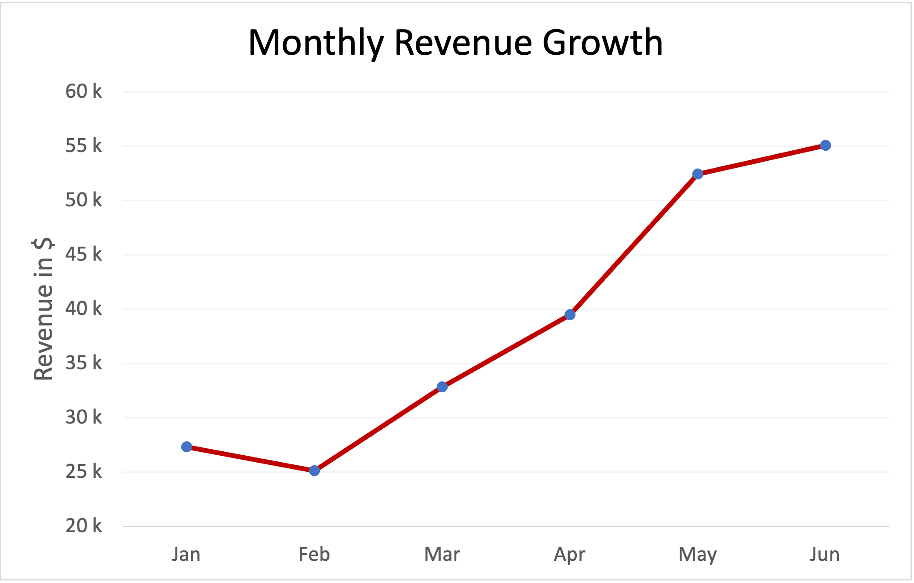
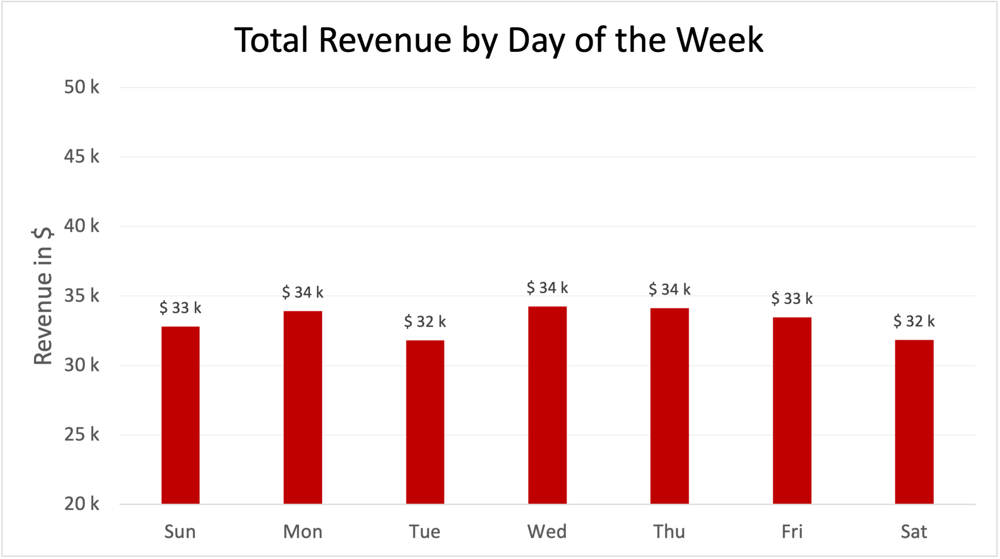
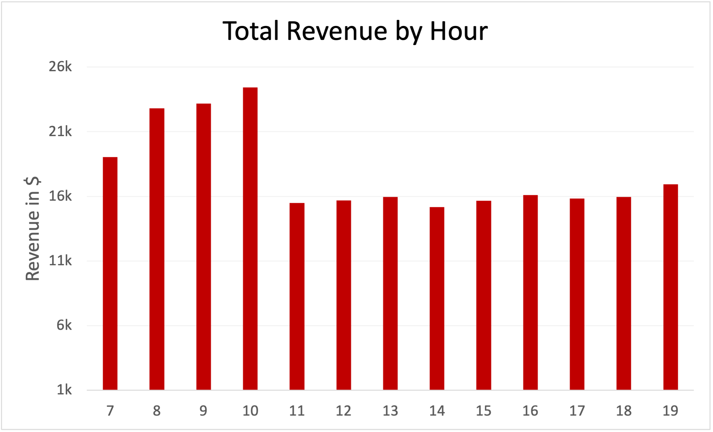
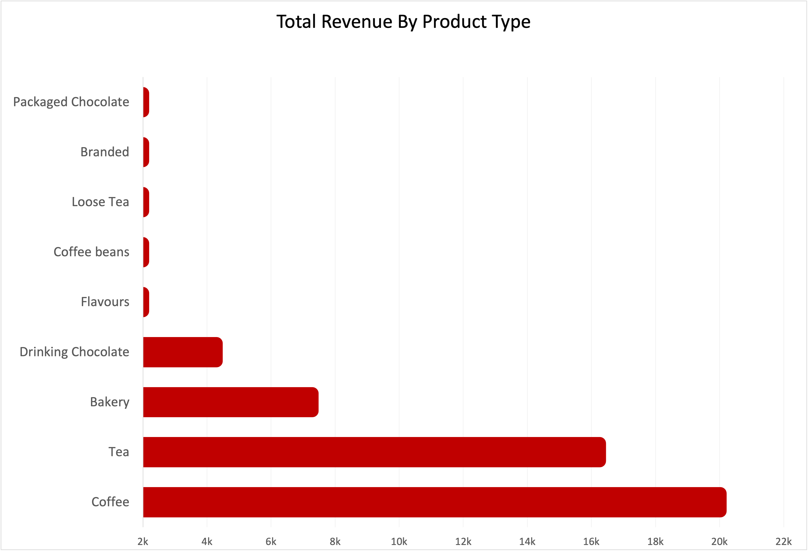
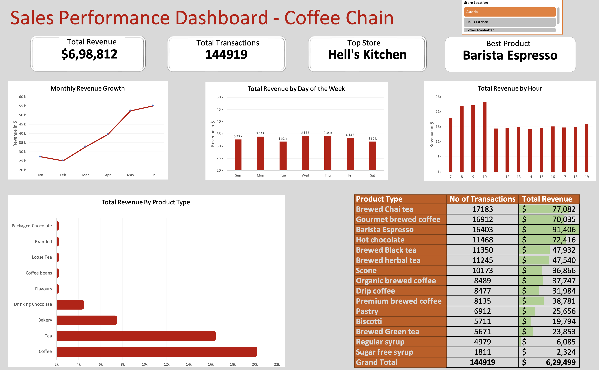

# ☕ Sales Performance Dashboard - Coffee Chain

This dashboard provides a comprehensive analysis of sales data for a coffee chain, helping stakeholders identify revenue patterns, top-performing products, and business trends over time.

---

## 📊 Project Overview

The goal of this project was to build an interactive and insightful **Sales Performance Dashboard** to visualize the coffee chain’s revenue metrics. The dashboard highlights **total revenue**, **transaction volume**, **top-performing stores**, and **best-selling products**, along with time-based and category-based breakdowns.

---

## 🔧 Tools Used

- **Microsoft Excel** for data preparation and dashboard creation  
- **Pivot Tables & Charts** for aggregating and visualizing metrics  
- **Conditional Formatting** for visual emphasis on high-performing products  
- **Slicers** for store-level filtering

---

## 📌 Key Performance Indicators (KPIs)

| Metric               | Value         | Description |
|----------------------|---------------|-------------|
| 💰 Total Revenue      | **$698,812**   | Total income across all stores and products |
| 🧾 Total Transactions | **144,919**    | Number of completed purchases |
| 🏪 Top Store          | **Hell's Kitchen** | Highest revenue-generating store |
| ☕ Best Product       | **Barista Espresso** | Most profitable product |

---

## 📈 Visual Insights

# 📈 Monthly Revenue Growth

This line chart visualizes the revenue trends for the coffee chain over a six-month period, from January to June.

## Key Insights:
- 📉 **February Dip**: Revenue slightly declined from $26k in January to $25k in February.
- 📈 **Consistent Growth**: From March onward, there is a strong upward trend, with revenue increasing every month.
- 🚀 **Peak in May**: The largest jump occurs between April ($39k) and May ($51k), indicating a successful month—possibly due to promotions or seasonality.
- ✅ **June High**: The growth continues into June, reaching approximately $55k, marking the highest monthly revenue in this period.

## Interpretation:
The chart demonstrates a positive revenue trajectory after a slow start.

---

# 📊 Total Revenue by Day of the Week

This bar chart displays the total revenue generated by the coffee chain on each day of the week.

## Key Observations:
- 🏆 **Highest Revenue Day**: Monday leads with $34k, slightly outperforming all other days.
- 🔁 **Consistent Midweek Performance**: Tuesday through Friday maintain steady revenues around $33k, showing minimal variance.
- 📉 **Weekends**: Saturday and Sunday have slightly lower revenues (~$32k), but still comparable to weekdays.

## Interpretation:
Revenue remains remarkably consistent across all days, indicating stable customer demand throughout the week. The slight uptick on Monday could suggest a strong start-of-week coffee run or promotional effectiveness.

This chart highlights a balanced sales distribution, useful for staff scheduling, inventory planning, and understanding customer behavior by day.

---

# ⏰ Total Revenue by Hour

This bar chart illustrates how revenue is distributed throughout the day, broken down by the hour.

## Key Observations:
- 🚀 **Peak Hours**:
  - 10 AM shows the highest revenue at just over $30k, closely followed by 8 AM and 9 AM (both ~$28k–29k).
- ☕ **Morning Rush**: Revenue skyrockets between 7 AM and 10 AM, clearly indicating peak business hours.
- 💤 **Afternoon Decline**: Revenue drops significantly after 11 AM, with a mild afternoon bump between 2 PM and 4 PM.
- 🌙 **Evening Slump**: After 5 PM, revenue sharply declines, hitting near-zero by 8 PM–9 PM.

## Interpretation:
The coffee chain experiences strong morning demand, likely due to commuter and workday patterns. This insight is valuable for:
- Optimizing staff scheduling in the early hours.
- Launching promotions during slower hours (post-lunch).
- Planning inventory to match peak demand times.

---

# 🛍️ Total Revenue by Product Type

This horizontal bar chart breaks down the total revenue by each product category offered by the coffee chain.

## Key Insights:
- ☕ **Top Contributor**:
  - Coffee is the highest revenue-generating category, contributing around $18k, indicating it’s the most in-demand product type.
- 🍵 **Strong Supporters**:
  - Tea comes second with revenue over $14k, showing it’s also a key product.
  - Bakery items are in third place (~$8k), reinforcing the popularity of coffee + snack combinations.
- 🧃 **Mid-Tier Performers**:
  - Drinking Chocolate and Flavours bring in moderate revenue (~$3k–$4k).
- 🍫 **Low Performers**:
  - Coffee beans, Loose Tea, Branded items, and Packaged Chocolate generate the least revenue, each under $1k–$2k.

## Interpretation:
- Focus marketing and inventory efforts on Coffee, Tea, and Bakery items to maximize sales.
- Explore cross-selling strategies with lower-performing products (e.g., pair packaged chocolate with hot beverages).
- Consider promotional campaigns or repositioning to boost the appeal of low-revenue products.

---

# 📊 Product Performance Summary

The table below presents the number of transactions and total revenue for each product type. This breakdown helps identify top-performing items and potential areas for improvement.

## Top Revenue Generators 💰

| Product                    | Revenue ($) | Transactions |
|----------------------------|-------------|--------------|
| ☕ **Barista Espresso**      | 91,406      | 16,403       |
| 🍵 **Brewed Chai Tea**      | 77,082      | 17,183       |
| 🍫 **Hot Chocolate**        | 72,416      | 11,468       |
| ☕ **Gourmet Brewed Coffee**| 70,035      | 16,912       |

- Barista Espresso is the best-selling product in terms of total revenue, despite slightly fewer transactions than Chai Tea.
- Brewed Chai Tea leads in number of transactions but generates slightly less revenue per sale.

## Mid-Performing Products ⚖️

| Product                    | Revenue ($) | Transactions |
|----------------------------|-------------|--------------|
| 🫖 **Brewed Black Tea**     | 47,932      | 11,350       |
| 🌿 **Brewed Herbal Tea**   | 47,540      | 11,245       |
| 🧁 **Scone**                | 36,866      | 10,173       |
| ☕ **Organic Brewed Coffee**| 37,747      | 8,489        |
| ☕ **Premium Brewed Coffee**| 38,781      | 8,135        |

- These products show moderate sales volume and consistent revenue, indicating a loyal but smaller customer base.

## Low Revenue Products 📉

| Product                    | Revenue ($) | Transactions |
|----------------------------|-------------|--------------|
| 🥐 **Pastry**               | 25,656      | 6,912        |
| 🍪 **Biscotti**             | 19,794      | 5,711        |
| 🍵 **Brewed Green Tea**     | 23,853      | 5,671        |
| 🧂 **Regular Syrup**        | 6,085       | 4,979        |
| ❌ **Sugar Free Syrup**     | 2,324       | 1,811        |

- These items represent niche or add-on products. Consider bundling or promotions to increase visibility and sales.

## Overall Performance
- **Total Transactions**: 144,919
- **Total Revenue**: $629,499

# ✅ Conclusion

This dashboard offers a comprehensive view of the coffee chain’s sales performance across multiple dimensions—time, product types, and customer behavior. Key findings include:

- 📈 A strong upward revenue trend from March to June, indicating successful growth strategies.
- ⏰ Peak revenue hours between 7 AM and 10 AM, driven by commuter and workday demand.
- 📊 Steady sales performance throughout the week, with slightly higher activity on Mondays.
- 🛍️ Coffee, Tea, and Bakery items dominate product revenue, while niche products offer opportunities for bundling and promotion.
- 🧾 High-performing individual items like Barista Espresso and Brewed Chai Tea are central to overall revenue generation.

These insights can guide strategic decisions in areas such as staffing, inventory management, marketing campaigns, and product development. Overall, the analysis highlights a well-performing business with clear areas to optimize for even greater efficiency and profitability.

---

# Final Dasboard

